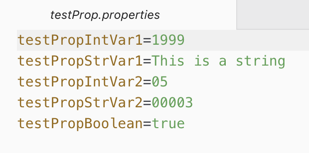
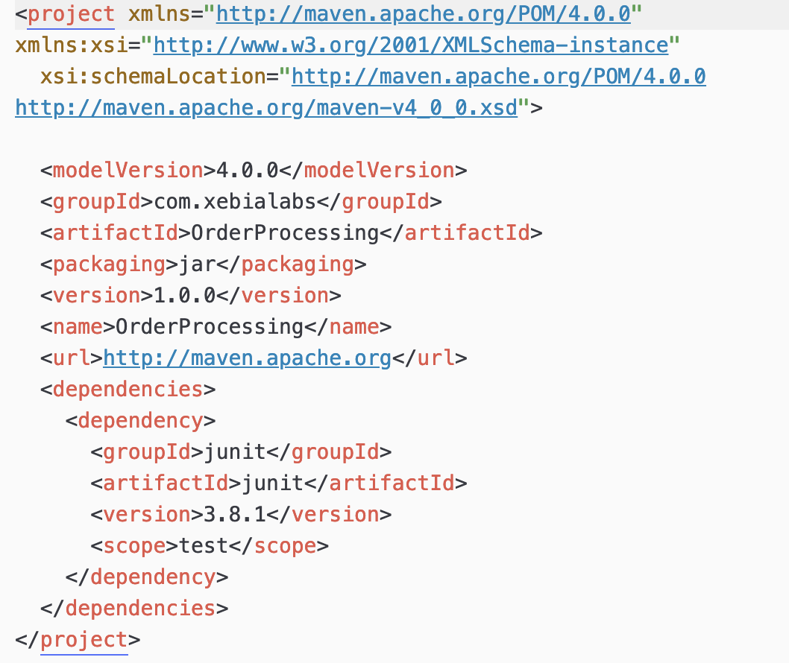
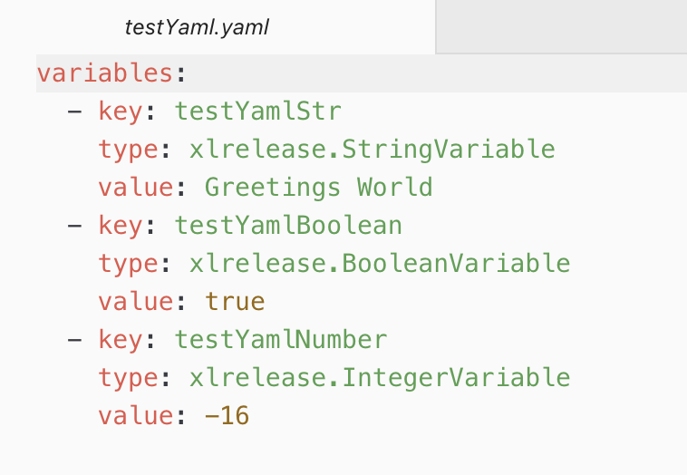
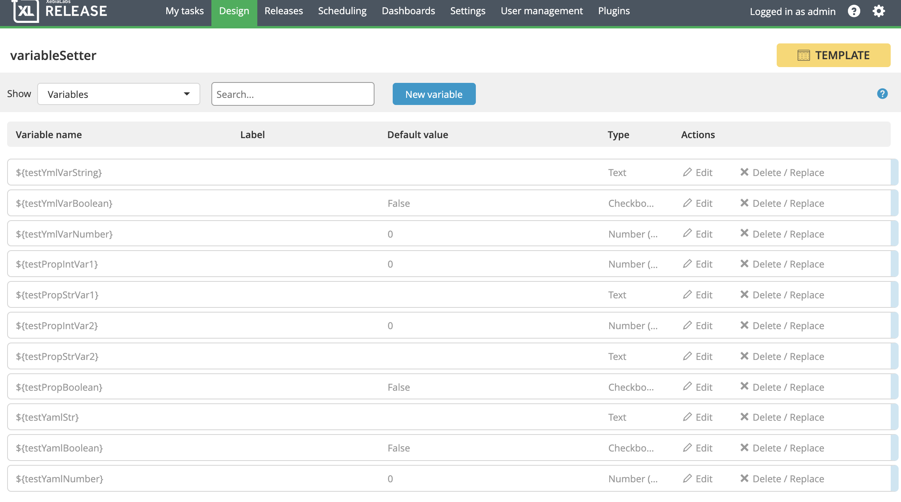
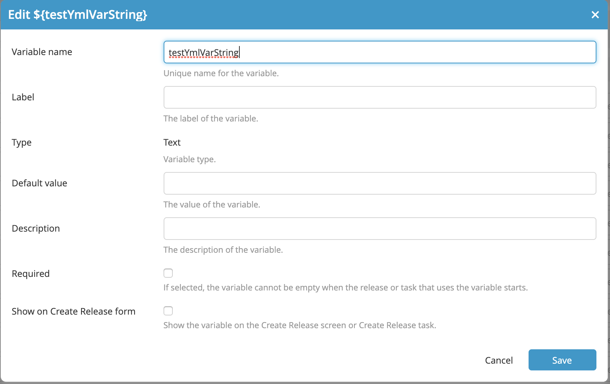
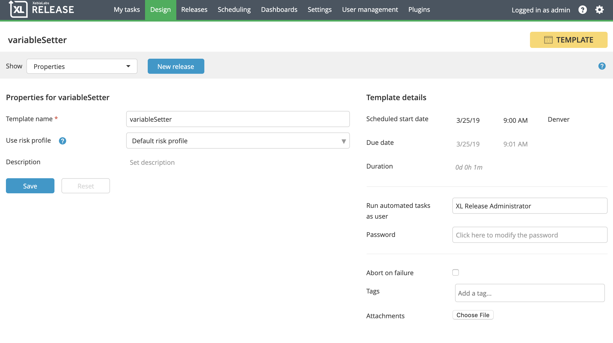
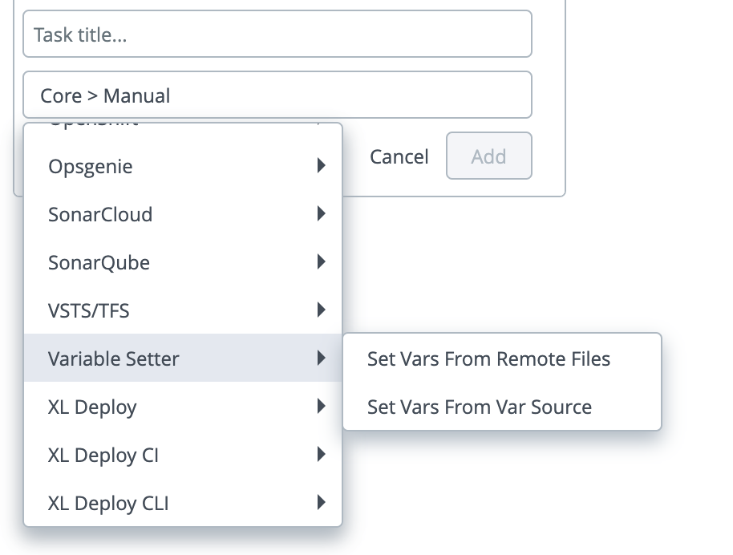

# XL Release Variable Setter Plugin

[![Build Status][xlr-variable-setter-plugin-travis-image]][xlr-variable-setter-plugin-travis-url]
[![Codacy Badge][xlr-variable-setter-plugin-codacy-image] ][xlr-variable-setter-plugin-codacy-url]
[![Code Climate][xlr-variable-setter-plugin-code-climate-image] ][xlr-variable-setter-plugin-code-climate-url]
[![License: MIT][xlr-variable-setter-plugin-license-image]][xlr-variable-setter-plugin-license-url]
[![Github All Releases][xlr-variable-setter-plugin-downloads-image]]()

## Preface

This document describes the functionality provided by the XL Release xlr-variable-setter-plugin. 
 
See the [XL Release reference manual](https://docs.xebialabs.com/xl-release) for background information on XL Release and release automation concepts.  

## Overview

The plugin provides the ability to populate Release Variables with values retrieved from remote property, XML, or YAML files that are accessible via URL. One use case is a single XL Release Template used for multiple projects stored in multiple repositories with project specific Release Variable values stored in a property, XML, or YAML file within each repository. The plugin task _Set Variables From Remote Files_ will retrieve and parse each specified file and then set the values of designated Release Variables. 
Note: The plugin sets existing Release Variables. It does not create Release Variables. 

## Requirements

*  **XL Release**   8.5.0+

## Installation

*   Copy the latest JAR file from the [releases page](https://github.com/xebialabs-community/xlr-variable-setter-plugin/releases) into the `XL_RELEASE_SERVER/plugins/__local__` directory.
*   Restart the XL Release server.

## Usage

### Create Files

Begin by creating one or more property, XML, or YAML files and put them where they can be retrieved using a URL (a Git repository, for example). Use the following examples as a guideline for your files. 

NOTE:
1.  Property files must have the extension .properties.
2.  XML files must have the extension .xml.
3.  YAML files must have the extension .yaml or .yml.
4.  Property files are simple name=value pairs with the name corresponding to a Release Variable name you will configure in the XLR Release Template.
5.  YAML files must begin with the `variables` declaration. The key value corresponds to the Release Variable name configured in XL Release, and the type designation corresponds to the type of the Release Variable. The type must have one of these three values `xlrelease.StringVariable`, `xlrelease.BooleanVariable`, or `xlrelease.IntegerVariable`. The type `xlrelease.BooleanVariable` corresponds to the 'Checkbox' type in XL Release.

#### Property File Example

#### XML File Example

#### YAML File Example



### Create Release Variables
Create one or more Release Variables of type Text, Number, or Checkbox (Boolean). The plugin will populate only existing variables. It will not create new variables. Name the variable to match the name used in the file.
NOTE: Follow this XPATH-like naming convention for variables that will be retrieved from XML files:
    1. Use underscores instead of slashes in the XPATH.
    2. In the example xml, shown above, the variable for the value project/groupId must be named project_groupId


Configure the variable with a name, a type and an empty default value. Uncheck the 'Required' and 'Show on Create Release form' options.


### Configure the Template to 'Run as User'
**IMPORTANT!** The template or release must run as a user with sufficient permissions to update Release Variables.


### Configure the plugin task
The xlr-variable-setter-plugin has a single task - Set Variables From Remote Files.



1.  Enter the Username and Password for the site from which the property, XML, or YAML file(s) will be retrieved.
2.  Enter template for the URL where the file(s) will be retrieved. This URL must contain the literal string :filename: as a placeholder for the property, XML, or YAML file filenames.  For example, https://server.com/foo/:filename:  or http://host/project/repo1/:filename:?raw
3.  Enter a list of file names. The plugin can process property, XML, or YAML files and expects file name extensions to be either .properties, .xml, .yml , or .yaml.
4.  If a listed file is not found the default behavior is to continue on with the task and retrieve the next file in the list. If 'Fail if file not found' is checked, however, the task will fail if a listed file is not retrieved. 

## Developers 

Build and package the plugins with...

```bash
./gradlew assemble
```

### To run integration tests - 
1.  You will need to have Docker  and Docker Compose installed.
2.  The XL-Release image expects to find a valid XL-Release license on your machine, at this location: ~xl-licenses/xl-release-license.lic.
3.  Open a terminal in the root of the xlr-variable-setter-plugin project and run the following test 

```bash
./gradlew clean integrationTest
```
    
The test will set up a temporary xlr/mockserver testbed using docker. The mockserver is used to serve up the property or YAML files. After testing is complete, the test docker containers are stopped and removed. 

### To run demo or dev version (set up docker containers for both XLR and the mock server)
    
NOTE:
1.  For requirements, see the 'To run integration tests' above.
2.  XL Release will run on the [localhost port 15516](http://localhost:15516/).
3.  The XL Release username / password is admin / admin.
4.  The Mockserver runs on the [localhost port 5099](http://localhost:5099/).
5.  The example YAML, XML and property files used in the demo are located in the <xlr-varible-setter-plugin code base>/src/test/resources/mockserver/responses directory.
6.  To run the dev/demo mode, open a terminal, cd into the src/test/resources/docker directory of the plugin code and run

```bash
docker-compose up -d
```
After XLR starts up, log in using the admin / admin credentials and then use the XLR 'Import Template' feature to import the template found in the src/test/resources/docker/initialize/data directory. You can then create a release and run the test example.

[xlr-variable-setter-plugin-travis-image]: https://travis-ci.org/xebialabs-community/xlr-variable-setter-plugin.svg?branch=master
[xlr-variable-setter-plugin-travis-url]: https://travis-ci.org/xebialabs-community/xlr-variable-setter-plugin

[xlr-variable-setter-plugin-codacy-image]: https://api.codacy.com/project/badge/Grade/88dec34743b84dac8f9aaaa665a99207
[xlr-variable-setter-plugin-codacy-url]: https://www.codacy.com/app/ladamato/xlr-variable-setter-plugin

[xlr-variable-setter-plugin-code-climate-image]: https://codeclimate.com/github/xebialabs-community/xlr-variable-setter-plugin/badges/gpa.svg
[xlr-variable-setter-plugin-code-climate-url]: https://codeclimate.com/github/xebialabs-community/xlr-variable-setter-plugin

[xlr-variable-setter-plugin-license-image]: https://img.shields.io/badge/License-MIT-yellow.svg
[xlr-variable-setter-plugin-license-url]: https://opensource.org/licenses/MIT
[xlr-variable-setter-plugin-downloads-image]: https://img.shields.io/github/downloads/xebialabs-community/xlr-variable-setter-plugin/total.svg
