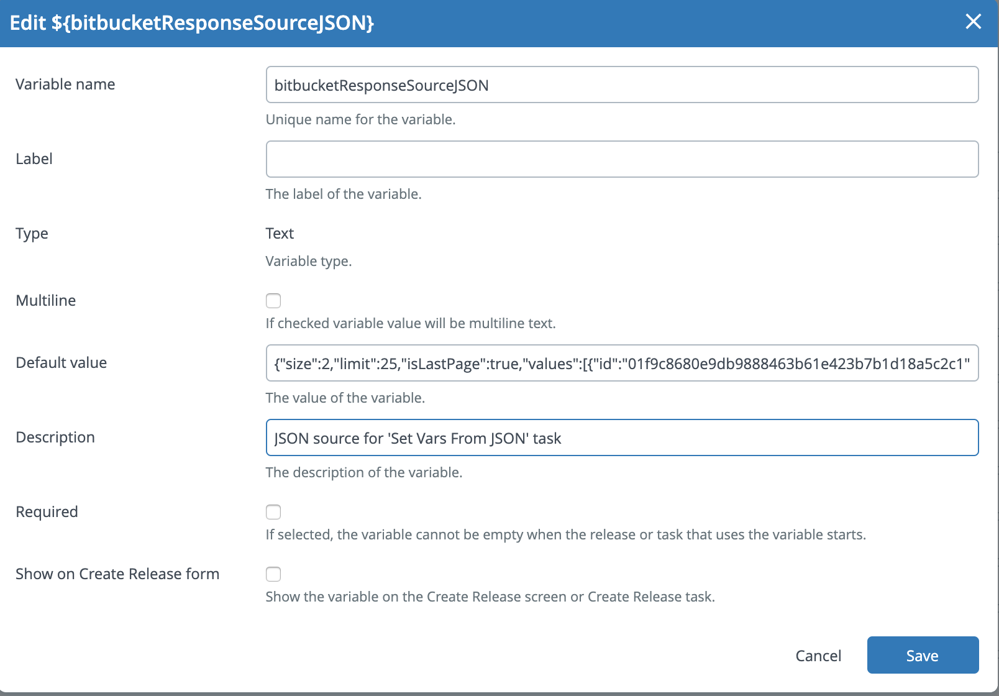
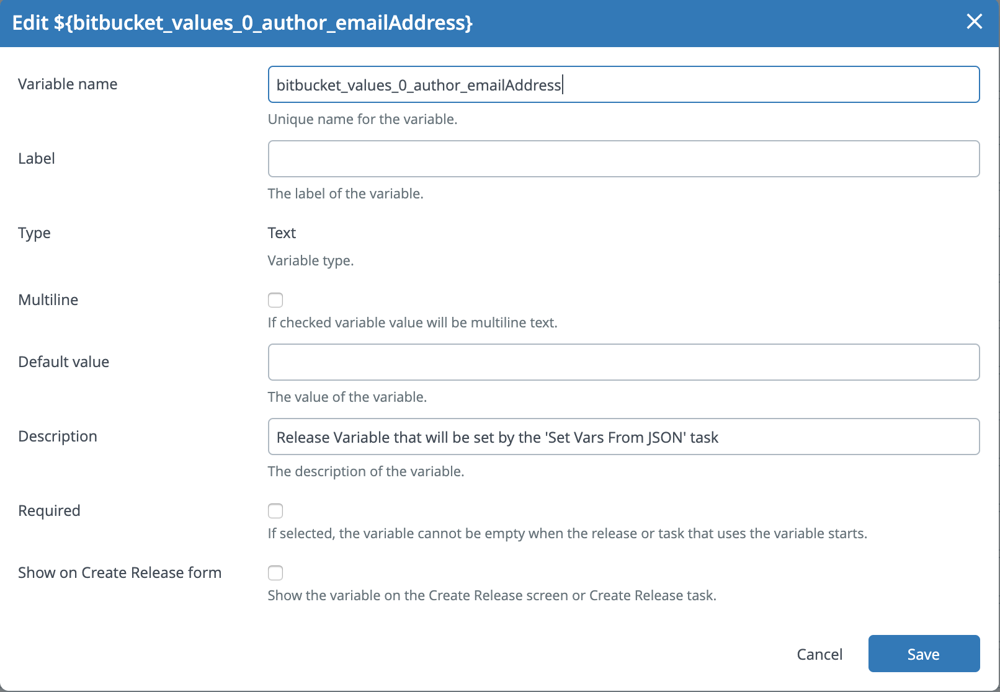
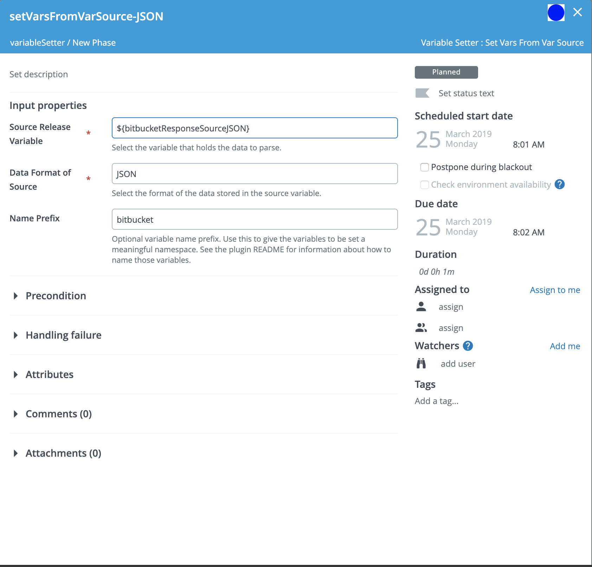

# XL Release Variable Setter Plugin

[![Build Status][xlr-variable-setter-plugin-travis-image]][xlr-variable-setter-plugin-travis-url]
[![Codacy Badge][xlr-variable-setter-plugin-codacy-image] ][xlr-variable-setter-plugin-codacy-url]
[![Code Climate][xlr-variable-setter-plugin-code-climate-image] ][xlr-variable-setter-plugin-code-climate-url]
[![License: MIT][xlr-variable-setter-plugin-license-image]][xlr-variable-setter-plugin-license-url]
[![Github All Releases][xlr-variable-setter-plugin-downloads-image]]()

## Preface

This document describes the functionality provided by the XL Release xlr-variable-setter-plugin. 

See the [XL Release reference manual](https://docs.xebialabs.com/v.9.7/release#platform) for background information on XL Release and release automation concepts. 

This is a 'See It Work' plugin, meaning it has been enhanced to include functionality that makes it easy to spin up and configure a dockerized version of the XebiaLabs platform with this plugin installed. Using the provided test data, you can then try out the plugin features. This is useful for familiarizing yourself with the plugin functionality, for demonstrations, testing and for further plugin development.

The plugin code base also includes a gradle task for [automatic integration testing](#to-run-integration-tests).

## Overview

The plugin provides an number of ways to dynaically populate Release variables. The first task, _Set Vars From Remote Files_ provides the ability to populate Release Variables with values retrieved from remote JSON, property, XML, or YAML files that are accessible via URL. One use case example is a single XL Release Template, used for multiple projects which are stored in multiple repositories with project specific Release Variable values stored in a JSON, property, XML, or YAML file within each repository. The plugin task _Set Vars From Remote Files_ will retrieve and parse each specified file and then set the values of designated Release Variables.

A second task, _Set Vars From Var_, has been added. This task will parse JSON or XML that has been stored in a Release Variable and uses the values found therein to populate other Release Variables. A possible use case would be to store the JSON returned in the POST body of a webhook call used start a release in a Release Variable and then use the task to parse that JSON and set the values of other Release Variables to be used downstream in the Release.

IMPORTANT: The plugin will set values only for pre-existing Release Variables. The plugin does not create new variables. Part of the template or release creation process will involve creating these variables with empty or default values that will then be replaced when the tasks are invoked.

## Requirements

* **XL Release**   8.5.0+

## Installation

* Copy the latest JAR file from the [releases page](https://github.com/xebialabs-community/xlr-variable-setter-plugin/releases) into the `XL_RELEASE_SERVER/plugins/__local__` directory.
* Restart the XL Release server.

## Configure the Template to 'Run as User'

**IMPORTANT!** Any template or release that is configured to use tasks from this plugin must run as a user with sufficient permissions to update Release Variables.


## Usage : Set Vars From Remote Files Task

This updates release variables with values retrieved from a file.

### Create Files

Begin by creating one or more property, XML, or YAML files and put them where they can be retrieved using a URL (a Git repository, for example). Use the following examples as a guideline for your files.

NOTE:

1. JSON files must have the extension .json.
2. Property files must have the extension .properties.
3. XML files must have the extension .xml.
4. YAML files must have the extension .yaml or .yml.
5. Property files are simple name=value pairs with the name corresponding to a Release Variable name you will configure in the XLR Release Template.
6. YAML files must begin with the `variables` declaration. The key value corresponds to the Release Variable name configured in XL Release, and the type designation corresponds to the type of the Release Variable. The type must have one of these three values `xlrelease.StringVariable`, `xlrelease.BooleanVariable`, or `xlrelease.IntegerVariable`. The type `xlrelease.BooleanVariable` corresponds to the 'Checkbox' type in XL Release.

#### JSON File Example

See below, under heading - _Variable Naming Convention for the 'Set Vars From Var' Task_

#### Property File Example


#### XML File Example


#### YAML File Example


### Create Release Variables
Create one or more Release Variables of type Text, Number, or Checkbox (Boolean). The plugin will populate only existing variables. It will not create new variables. Name the variable to match the name used in the file.

NOTE: Follow this XPATH-like naming convention for variables that will be retrieved from XML files:

1. Use underscores instead of slashes in the XPATH.
2. In the example xml, shown above, the variable for the value project/groupId must be named project_groupId

NOTE: Release Variables that will be updated when JSON files parsed are named similarly to those updated from XML files. 

1. Use the name path separated by underscores. 
2. In addition, the variable can include an index notation for managing arrays. Please see the naming convention described below in the _Variable Naming Convention for the 'Set Vars From Var' Task_ section of this README.


Configure the variable with a name and a type and an optional default value. Uncheck the 'Required' and 'Show on Create Release form' options.


### Configure the Set Vars From Remote Files plugin task

The xlr-variable-setter-plugin has a task - Set Vars From Remote Files.


1. Enter the Username and Password for the site from which the property, XML, or YAML file(s) will be retrieved.
2. Enter a template string for the URL where the file(s) will be retrieved. This URL must contain the literal string :filename: as a placeholder for the property, XML, or YAML file filenames.  For example, https://server.com/foo/:filename:  or http://host/project/repo1/:filename:?raw
3. Enter a list of file names. The plugin can process property, XML, or YAML files and expects file name extensions to be either .properties, .xml, .yml , or .yaml.
4. If a listed file is not found the default behavior is to continue on with the task and retrieve the next file in the list. If 'Fail if file not found' is checked, however, the task will fail if a listed file is not retrieved.

## Usage : Set Vars From Var Task

This task updates Release Variables with values retrieved from a JSON or XML source that has been stored in another Release Variable. The JSON or XML source stored in the source Release Variable is parsed by the 'Set Vars from Var' task which then updates other specifically named Release Variables.  An example of a JSON source might be the JSON returned in the POST body of a webhook call to start a release. IMPORTANT: The plugin will set values only for pre-existing Release Variables. The plugin does not create new variables. Part of template or release creation process will involve creating these variables with empty or default values that will then be replaced when the release runs.

### Variable Naming Convention for the 'Set Vars From Var' Task

The Release Variable you create to hold the source JSON or XML can have any name but, as mentioned previously, the Release Variables you want to set via the 'Set Vars from Var' task must follow a specific naming pattern. As complex JSON or XML objects are parsed, a name is built from the path. The Release Variable you wish to set must be named to match that path. You can configure an optional prefix to be added to the path so the variable will have a more meaningful name. Please see the screenshots and example below.

Below is a sample commit message from BitBucket. Say you wanted the first author's email address in a release variable.  You can see this is the first element in the 'values' array.  The email address is within the 'author' object.  The JSON parser would build a name from as follows:

```bash
<name prefix>_values_0_author_emailAddress
```

where:

* \<name prefix\>: an optional task property.  It lets you partition variable names to a namespace.
* values: name of json array
* 0: the first array index.  A following array element would be '1', then '2', and so on. Please note, at this time the plugin does not handle arrays of repeated XLM elements.
* author: the json object name
* emailAddress: the json string name

Assume that you have created a Release Variable named 'bitbucketResponseSourceJSON' and have set up the bitbucket task to store the response JSON in that variable.
If, within the 'Set Vars From Var' task configuration, you set the prefix to be 'bitbucket', you should then create an empty Release Variable of type 'Text' with a name of 'bitbucket_values_0_author_emailAddress'. When the 'Set Vars From Var' task in runs, the contents of 'bitbucketResponseSourceJSON' Release Variable will be parsed and the Release Variable bitbucket_values_0_author_emailAddress will be populated with the value sruiz@atlassian.com.  

```json
{
    "size": 2,
    "limit": 25,
    "isLastPage": true,
    "values": [
      {
        "id": "01f9c8680e9db9888463b61e423b7b1d18a5c2c1",
        "displayId": "01f9c86",
        "author": {
          "name": "Seb Ruiz",
          "emailAddress": "sruiz@atlassian.com"
        },
        "authorTimestamp": 1334730200000,
        "message": "NONE: Add groovy as java synhi\n+review @aahmed",
        "parents": [
          {
            "id": "06a499d51107533a4f24a3620280edbb342d89b7",
            "displayId": "06a499d"
          }
        ],
        "attributes": {}
      },
      {
        "id": "c9d6630b88143dab6a922c5cffe931dae68a612a",
        "displayId": "c9d6630",
        "author": {
          "name": "Pierre-Etienne Poirot",
          "emailAddress": "pepoirot@atlassian.com"
        }
      }
    ],
    "start": 0,
    "filter": null,
    "nextPageStart": 2
  }
  ```

In summary, these are the steps you would take to setup a 'Set Vars From Var' task:

1. Create a Release Variable of type Text to hold the source JSON or XML. This variable can be populated by another XLR task or can be set with a default value. 
2. Create the Release Variables that will be populated by the 'Set Vars From Var' task. Follow the naming convention described above. The variable can be type text, integer or checkbox (boolean). Uncheck the 'Required' and 'Show on Create Release form' options. 
3. Configure that task by setting the source JSON release variable and by setting the optional name prefix.

### Configure the Set Vars From Var plugin task




## Developers

Build and package the plugins with...

```bash
./gradlew assemble
```

### To run integration tests

1. You will need to have Docker  and Docker Compose installed.
2. The XL-Release image will use the community license. Note that by using this license, you are accepting the [End User License Agreement](https://dist.xebialabs.com/public/legal/eula-artifacts-v10.txt). If you prefer to use your own license, modify the docker-compose.yml file.
3. Plugin log files will be written to <plugin source code directory>/build/reports/tests/log directory
4. Open a terminal in the root of the xlr-variable-setter-plugin project and run the following test  

```bash
./gradlew clean integrationTest
```

The test will set up a temporary xlr/mockserver testbed using docker. The mockserver is used to serve up the property or YAML files. After testing is complete, the test docker containers are stopped and removed.

### To run demo or dev version (set up docker containers for both XLR and the mock server)

NOTE:

1. For requirements, see the 'To run integration tests' above.
2. XL Release will run on the [localhost port 15516](http://localhost:15516/).
3. The XL Release username / password is admin / admin.
4. The Mockserver runs on the [localhost port 5099](http://localhost:5099/).
5. The Mockserver username / password is xlr_test / admin.
6. The example YAML, XML and property files used in the demo are located in the <xlr-varible-setter-plugin code base>/src/test/resources/mockserver/responses directory. The XLR template contains the example JSON source for the 'Set Vars from JSON' task.
7. Before running the demo, be sure to create the plugin by opening a terminal, cd into the plugin source code directory, and run

```bash
./gradlew clean build
```

8. To run the dev/demo mode, open a terminal, cd into the src/test/resources/docker directory of the plugin code and run

```bash
docker-compose up
```

After XLR starts up, log in using the admin / admin credentials and then use the XLR 'Import Template' feature to import the template found in the src/test/resources/docker/initialize/data directory. You can then create a release and run the test example.

To shut down and remove the docker containers, in the src/test/resources/docker/initialize/data directory, run

```bash
docker-compose down
```

[xlr-variable-setter-plugin-travis-image]: https://travis-ci.org/xebialabs-community/xlr-variable-setter-plugin.svg?branch=master
[xlr-variable-setter-plugin-travis-url]: https://travis-ci.org/xebialabs-community/xlr-variable-setter-plugin

[xlr-variable-setter-plugin-codacy-image]: https://api.codacy.com/project/badge/Grade/88dec34743b84dac8f9aaaa665a99207
[xlr-variable-setter-plugin-codacy-url]: https://www.codacy.com/app/ladamato/xlr-variable-setter-plugin

[xlr-variable-setter-plugin-code-climate-image]: https://codeclimate.com/github/xebialabs-community/xlr-variable-setter-plugin/badges/gpa.svg
[xlr-variable-setter-plugin-code-climate-url]: https://codeclimate.com/github/xebialabs-community/xlr-variable-setter-plugin

[xlr-variable-setter-plugin-license-image]: https://img.shields.io/badge/License-MIT-yellow.svg
[xlr-variable-setter-plugin-license-url]: https://opensource.org/licenses/MIT
[xlr-variable-setter-plugin-downloads-image]: https://img.shields.io/github/downloads/xebialabs-community/xlr-variable-setter-plugin/total.svg
